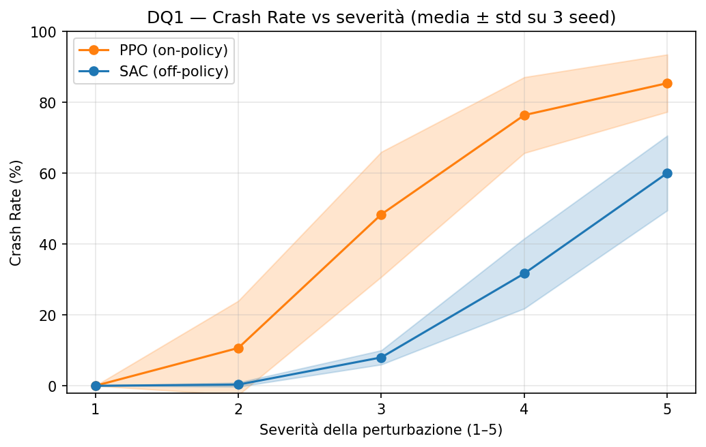
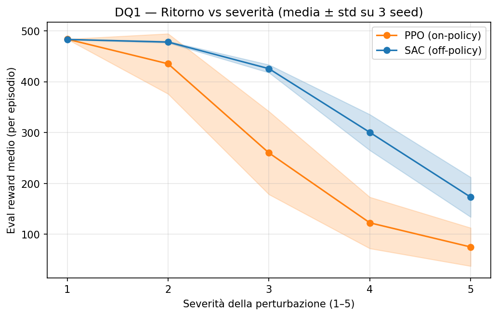
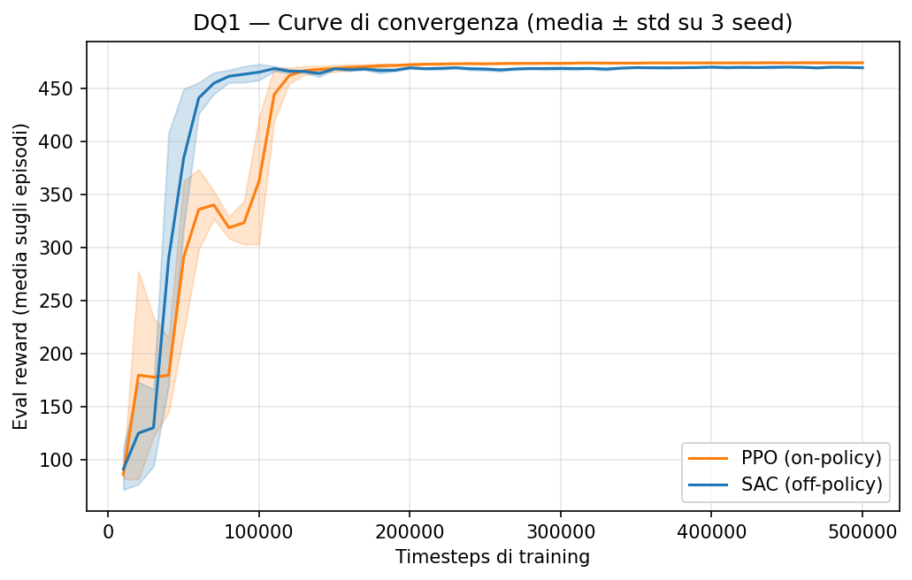
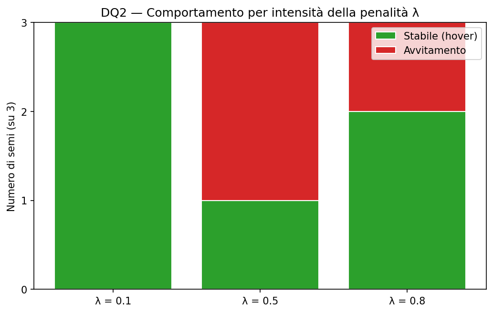
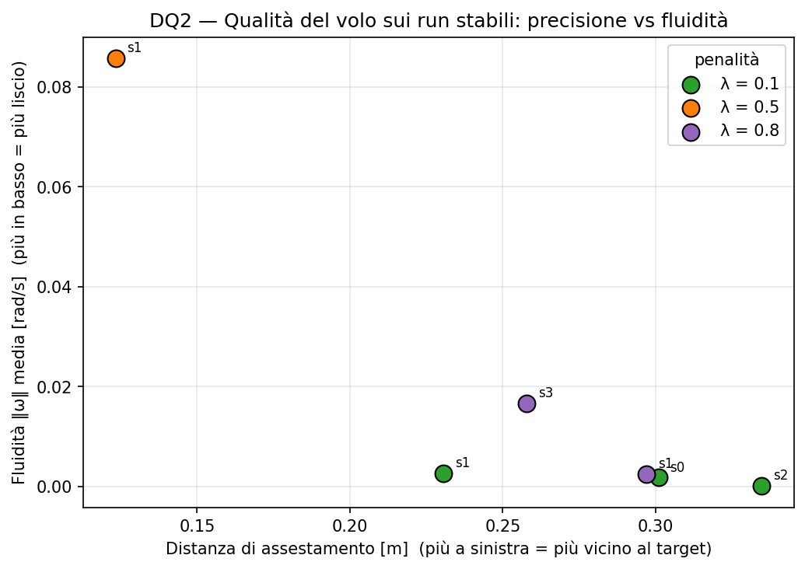
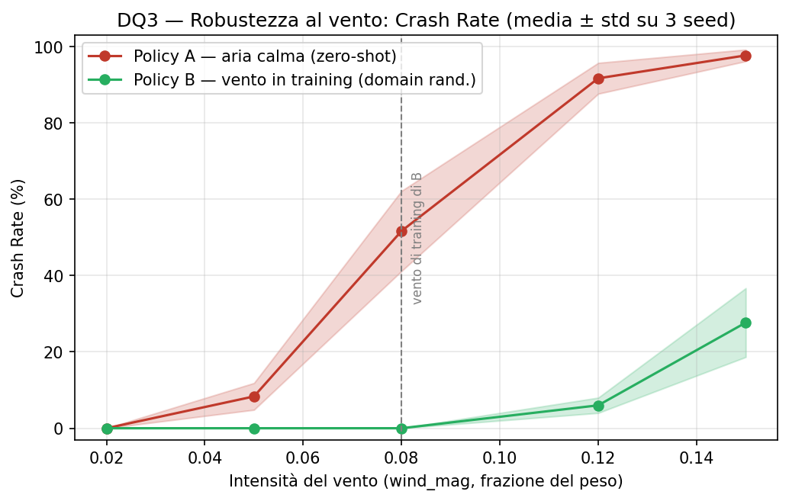
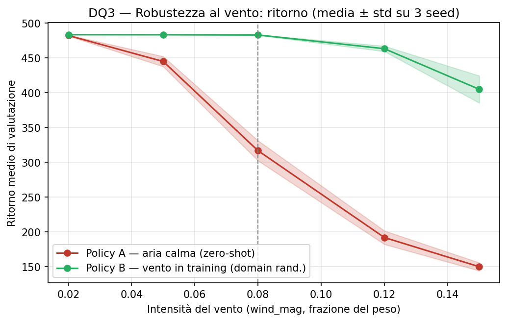

# StableHover — Reinforcement Learning per l'hovering di un quadrirotore

**Autore:** Luca Bellu (matricola 60/79/00295)
**Corso:** Deep Learning (SC/0081) — Università degli Studi di Cagliari, A.A. 2025/2026

## Panoramica

StableHover è uno studio sperimentale di Reinforcement Learning sul controllo del volo stazionario (hovering) di un quadrirotore, condotto nell'ambiente di simulazione gym-pybullet-drones. Il lavoro è organizzato attorno a tre domande di ricerca che ne scandiscono le fasi: il confronto tra una famiglia di algoritmi puramente reattivi (on-policy) e una basata sulla memorizzazione dell'esperienza passata (off-policy); l'effetto del reward shaping sulla fluidità del volo e il suo costo in termini di rapidità nel raggiungere il target; la robustezza del modello a turbolenze esterne e il ruolo della domain randomization in addestramento.

Gli algoritmi di apprendimento (PPO e SAC) provengono dalla libreria stable-baselines3; l'ambiente, la dinamica del drone e le convenzioni di osservazione e azione provengono da gym-pybullet-drones. Il contributo originale del progetto è nel disegno sperimentale, nelle modifiche all'ambiente necessarie a un confronto corretto, nella metodologia di valutazione e nell'analisi dei risultati, descritti nelle sezioni seguenti.

## Domande di ricerca

1. **Confronto tra algoritmi (Memoria vs. Reattività):** In un task di hovering spaziale, un algoritmo off-policy basato sulla memorizzazione dell'esperienza passata garantisce un tasso di schianti (Crash Rate) inferiore e una convergenza più stabile rispetto a un algoritmo on-policy puramente reattivo?
2. **Il "prezzo" della fluidità (Reward Shaping):** Applicando la tecnica del Reward Shaping all'algoritmo vincitore della Domanda 1, l'introduzione di una penalità quadratica per le variazioni brusche di potenza dei motori produce un volo stazionario significativamente più fluido, e quanto incide questo vincolo sul tempo necessario a raggiungere il target?
3. **Robustezza e Domain Randomization (L'aggiunta delle turbolenze):** Il modello ottimizzato per la fluidità (vincitore Domanda 2) è in grado di resistere a turbolenze esterne stocastiche (vento) introdotte in fase di valutazione, o è necessario addestrare una nuova policy iniettando disturbi fisici casuali durante il training per evitare la perdita di assetto?

## Ambiente e installazione

Il progetto è stato sviluppato su macOS con Apple Silicon, con gestione dell'ambiente tramite conda (miniforge) e Python 3.10. La 3.10 è la versione raccomandata dalla documentazione di gym-pybullet-drones.

L'ambiente di simulazione è una dipendenza di terzi e viene installato in una cartella separata dal progetto, per mantenere il repository contenente solo codice originale.

**Prerequisiti:** conda (miniforge o miniconda) e git.

### Procedura (macOS Apple Silicon)

Su Apple Silicon l'installazione di pybullet via pip fallisce in compilazione con i compilatori recenti di macOS; si installa quindi il binario pre-compilato da conda-forge prima delle altre dipendenze.

```bash
# 1. Ambiente isolato con Python 3.10
conda create -n drone-rl python=3.10
conda activate drone-rl

# 2. Clona il simulatore (dipendenza di terzi) in una cartella separata
mkdir -p ~/tools && cd ~/tools
git clone https://github.com/utiasDSL/gym-pybullet-drones.git
cd gym-pybullet-drones
git checkout 9bc12bc          # versione esatta usata nel progetto

# 3. pybullet pre-compilato PRIMA del resto (evita l'errore di compilazione clang)
conda install -c conda-forge pybullet

# 4. Strumento di build richiesto dal pacchetto
pip install poetry-core

# 5. Installa il simulatore senza ricompilare le dipendenze (pybullet è già presente)
pip install -e . --no-build-isolation --no-deps

# 6. Restanti dipendenze (pybullet escluso, già installato via conda)
pip install "numpy>=2.2" "scipy>=1.15" "transforms3d>=0.4" "matplotlib>=3.10" "gymnasium>=1.2" "stable-baselines3>=2.8" "control>=0.10.2" "pytest>=9.0" "jupyter"

# 7. Verifica
python -c "import gym_pybullet_drones, stable_baselines3, gymnasium; print('OK')"
```

I percorsi (`~/tools/`) e il nome dell'ambiente (`drone-rl`) sono le scelte adottate in questo progetto e possono essere adattati. Su piattaforme diverse da Apple Silicon è in genere sufficiente la procedura ufficiale del simulatore (`git clone` seguito da `pip install -e .`); la sequenza sopra è quella verificata per macOS Apple Silicon, dove il metodo standard fallisce.

Il file `requirements.txt` riporta le versioni esatte dei pacchetti con cui il progetto è stato eseguito. Nota: conda installa pybullet 3.2.5, leggermente precedente alla 3.2.7 indicata dal pacchetto; la differenza produce solo un avviso, verificato innocuo.

## Struttura della repository

```
drone-rl/
├── src/
│   ├── envs/
│   │   ├── hover_terminal.py     # ambiente di hovering in cui lo schianto termina l'episodio
│   │   ├── hover_shaped.py       # ambiente di hovering con penalità che premia comandi regolari
│   │   └── hover_wind.py         # ambiente di hovering con vento orizzontale stocastico (Ornstein-Uhlenbeck)
│   ├── train.py                  # addestra una singola policy (un algoritmo, un seed)
│   ├── evaluate.py               # valuta una policy: robustezza (DQ1/DQ3) e qualità del volo (DQ2)
│   └── visualize.py              # registra una clip MP4 del volo di una policy
├── scripts/
│   ├── run_dq1.sh                # addestra i 6 modelli della Domanda 1
│   ├── run_eval_dq1.sh           # valuta i modelli della Domanda 1 a condizioni nominali
│   ├── run_eval_sweep_dq1.sh     # valuta i modelli della Domanda 1 su 5 livelli di severità
│   ├── aggregate_eval.py         # riunisce i risultati della Domanda 1 in un unico CSV
│   ├── run_dq2.sh                # addestra i 9 modelli della Domanda 2
│   ├── run_eval_dq2.sh           # valuta i modelli della Domanda 2
│   ├── aggregate_dq2.py          # riunisce i risultati della Domanda 2 in un unico CSV
│   ├── run_dq3_policyB.sh        # addestra le 3 policy con vento della Domanda 3 (Policy B)
│   ├── run_eval_dq3.sh           # valuta Policy A e B su 5 intensità di vento
│   └── aggregate_dq3.py          # riunisce i risultati della Domanda 3 in un unico CSV
├── experiments/
│   ├── dq1/                      # modelli e risultati della Domanda 1
│   ├── dq2/                      # modelli e risultati della Domanda 2
│   └── dq3/                      # modelli e risultati della Domanda 3 (Policy B)
├── notebooks/
│   ├── dq1_confronto_ppo_sac.ipynb    # analisi e figure della Domanda 1
│   ├── dq2_reward_shaping.ipynb       # analisi e figure della Domanda 2
│   └── dq3_robustezza_vento.ipynb     # analisi e figure della Domanda 3
├── results/
│   ├── figures/                  # figure finali (.png)
│   ├── tables/                   # tabelle finali (.csv)
│   └── videos/                   # clip dimostrative del volo (.mp4)
├── assets/                       # logo, proposta di progetto, immagini di setup
├── requirements.txt
├── DIARIO.md                     # diario di progetto: decisioni e motivazioni in ordine cronologico
└── README.md
```

Il codice è separato per responsabilità. `src/` contiene la logica riutilizzabile: l'ambiente di simulazione e i due programmi a riga di comando per addestramento e valutazione, ciascuno parametrico su algoritmo e seed. `scripts/` contiene gli script di orchestrazione che compongono gli esperimenti di una domanda di ricerca, lanciando i programmi di `src/` con le combinazioni previste dal disegno sperimentale. La separazione tiene distinti il "come si esegue una singola operazione" (in `src/`) e il "quali operazioni compongono un esperimento" (in `scripts/`).

Gli artefatti generati dagli esperimenti — modelli, normalizzatori, valutazioni periodiche, riepiloghi — sono raccolti sotto `experiments/`, organizzati per domanda di ricerca e per run. Le figure e le tabelle definitive, prodotte dai notebook a partire da quegli artefatti, sono esportate sotto `results/` come file riutilizzabili. I notebook in `notebooks/` svolgono esclusivamente l'analisi: leggono gli artefatti e ne ricavano le visualizzazioni, senza eseguire addestramenti.

I modelli addestrati e i file di log non sono versionati, perché pesanti e rigenerabili dall'esecuzione degli esperimenti; figure e tabelle finali sono invece incluse nel repository.

## Metodologia sperimentale

Le scelte metodologiche seguenti sono comuni a tutte le domande di ricerca e garantiscono confronti equi e riproducibili.

Ogni configurazione è addestrata con **tre semi casuali** (0, 1, 2) e i risultati sono riportati come media e deviazione standard sui tre semi: la deviazione standard misura quanto un esito dipenda dal seme, cioè la riproducibilità dell'addestramento. Le condizioni messe a confronto ricevono sempre lo **stesso budget** di addestramento e non si applica early stopping: tutti i modelli vengono addestrati per il budget pieno, così che eventuali instabilità tardive non restino nascoste. Le valutazioni usano il **modello finale** di ogni run, non il checkpoint migliore, per non selezionare l'istante più favorevole.

Le condizioni di valutazione sono generate con un seme fisso e sono **identiche per tutti i modelli** confrontati: a parità di scenario, le differenze osservate dipendono dalla policy e non dalla variabilità campionaria. Ogni run salva un `config.json` con algoritmo, seme, budget, versioni delle librerie e hash del commit, per legare ciascun risultato al codice che lo ha prodotto.

Il confronto tra algoritmi è inteso a livello di **famiglie** (on-policy e off-policy), con PPO e SAC come rappresentanti: le conclusioni riguardano le famiglie, non i due algoritmi specifici presi isolatamente.

## Domanda 1 — Confronto PPO vs SAC

### Impostazione

Il confronto oppone PPO (on-policy, reattivo) e SAC (off-policy, dotato di replay buffer) sul task di hovering di `HoverAviary`, con osservazione cinematica (`kin`) e azione sui giri dei quattro motori (`rpm`), per un budget di 500.000 passi e tre semi.

Il task richiede una modifica all'ambiente. In `HoverAviary` l'uscita dall'inviluppo di volo sicuro è segnalata come troncamento (`truncated`); per un algoritmo off-policy questo è scorretto, perché induce a stimare un valore futuro non nullo per stati di schianto, da cui una divergenza delle stime di valore. La variante `HoverAviaryTerminal` (in `src/envs/`) tratta lo schianto come stato terminale (`terminated`), eliminando il problema. La correzione è applicata a entrambi gli algoritmi.

Le osservazioni sono normalizzate con statistiche correnti (medie e varianze), condizione necessaria alla stabilità di SAC su questo ambiente; la ricompensa è lasciata grezza per mantenere i ritorni interpretabili e confrontabili. Per SAC il coefficiente di entropia è fissato a 0.1, poiché la sua regolazione automatica diverge in questo contesto; PPO usa i valori predefiniti. Il funzionamento dettagliato è documentato nel codice e nei commenti dei rispettivi file.

Poiché a condizioni nominali entrambi gli algoritmi raggiungono lo 0% di schianti (la metrica non discrimina), la robustezza è misurata sottoponendo i modelli a condizioni iniziali perturbate di severità crescente su cinque livelli (offset di posizione, inclinazione e impulso di velocità a inizio episodio), con limiti che evitano partenze già oltre la soglia di schianto.

### Riproduzione

Dalla radice del progetto, con l'ambiente attivo:

```bash
conda activate drone-rl

# 1. Addestramento dei 6 modelli (~110 min su MacBook Air M5: PPO ~3 min/run, SAC ~33 min/run)
caffeinate -i bash scripts/run_dq1.sh

# 2. Valutazione di robustezza su 5 livelli di severità (pochi minuti)
caffeinate -i bash scripts/run_eval_sweep_dq1.sh

# 3. Aggregazione dei riepiloghi in un unico CSV
python scripts/aggregate_eval.py

# 4. Esecuzione del notebook di analisi: rigenera ed esporta figure e tabelle in results/
jupyter nbconvert --to notebook --execute --inplace notebooks/dq1_confronto_ppo_sac.ipynb
```

Le figure e le tabelle finali sono già incluse in `results/`. Per rigenerare solo le figure è sufficiente il passo 4, che legge i dati già versionati (`evaluations.npz` e `eval_sweep_results.csv`); per rigenerare l'intera catena a partire dai modelli occorre ripetere i passi 1–4, poiché i modelli addestrati non sono versionati.

### Risultati







SAC presenta un Crash Rate inferiore a ogni livello di severità, con bande tra semi che non si sovrappongono a quelle di PPO (a severità 3, circa 8% contro 48%) e una variabilità tra semi più contenuta. La robustezza si conferma su un secondo asse, indipendente dal Crash Rate: a parità di severità SAC mantiene ritorni di valutazione nettamente più alti (a severità 4 circa 300 contro 123, a severità 5 circa 173 contro 75), cioè non solo schianta meno, ma vola meglio quando sopravvive. Sul fronte della convergenza i due algoritmi raggiungono lo stesso livello di prestazione a regime (ritorno ~470), ma SAC vi arriva prima — supera la soglia di ricompensa di 400 a circa 60.000 passi contro i circa 110.000 di PPO — e con una fase di salita più stabile tra semi.

La risposta alla domanda è affermativa su entrambi gli assi considerati: l'algoritmo off-policy ottiene un Crash Rate inferiore e una convergenza più stabile. Il vantaggio si colloca nella velocità di convergenza, nella stabilità e nella robustezza, non nella prestazione finale a regime, che è equivalente per le due famiglie. SAC è quindi il modello adottato come base per la Domanda 2.

Una clip dimostrativa in `results/videos/` (`dq1_sac_seed0_sev3_kick.mp4`) mostra SAC che assorbe un impulso di velocità iniziale e recupera l'assetto fino all'hovering; la pallina rossa segna il target.


## Domanda 2 — Reward shaping per la fluidità del volo

### Impostazione

La seconda domanda applica il *reward shaping* all'algoritmo vincitore della prima (SAC) per ottenere un volo più fluido. Alla ricompensa nativa si aggiunge una penalità quadratica sulle variazioni del comando ai motori, `−λ·‖aₜ − aₜ₋₁‖²`, dove `aₜ` è il comando ai quattro motori e `λ` ne pesa l'intensità: variazioni brusche di potenza vengono scoraggiate, favorendo comandi regolari. La penalità è realizzata dalla variante `HoverAviaryShaped` (in `src/envs/`), che estende l'ambiente con terminazione corretto della Domanda 1; con `λ=0` il comportamento coincide con quello della Domanda 1, garantendo un confronto pulito.

Lo sweep copre una penalità lieve (`λ=0.1`), media (`λ=0.5`) e forte (`λ=0.8`), con tre semi per valore e budget identico a quello della Domanda 1. Il valore `λ=1.0` è stato escluso in fase di smoke test perché collassa l'apprendimento: con una penalità così alta il drone preferisce non muovere i motori e cade.

La valutazione classifica ogni episodio in tre comportamenti mutuamente esclusivi, osservando l'ultimo secondo di volo: **stabile** (il drone si mantiene fermo entro una zona attorno al target, con velocità angolare prossima a zero), **avvitamento** (il drone resta in volo ma ruota su sé stesso, con velocità angolare oltre 1 rad/s, invece di stabilizzarsi) e **schianto** (uscita dall'inviluppo di volo sicuro). Sui soli episodi stabili si misurano grandezze continue: la distanza di assestamento dal target, la fluidità (media della norma della velocità angolare, indipendente dalla quantità penalizzata per evitare circolarità nella misura) e il tempo di assestamento. La scelta di metriche continue, anziché di una soglia binaria di "target raggiunto", è motivata dalla forma della ricompensa nativa, piatta in prossimità del target, che non spinge il drone sull'ultimo decimetro e renderebbe arbitraria una soglia secca.

### Riproduzione

Dalla radice del progetto, con l'ambiente attivo:

```bash
conda activate drone-rl

# 1. Addestramento dei 9 modelli shaped (~5 h su MacBook Air M5: ~32 min/run)
caffeinate -i bash scripts/run_dq2.sh

# 2. Valutazione della qualità del volo dei 9 modelli (pochi minuti)
bash scripts/run_eval_dq2.sh

# 3. Aggregazione dei riepiloghi in un unico CSV
python scripts/aggregate_dq2.py

# 4. Esecuzione del notebook di analisi: rigenera ed esporta figure e tabelle in results/
jupyter nbconvert --to notebook --execute --inplace notebooks/dq2_reward_shaping.ipynb
```

Le figure e le tabelle finali sono già incluse in `results/`. Per rigenerare solo le figure è sufficiente il passo 4, che legge il file già versionato (`results/tables/dq2_summary.csv`).

### Risultati





L'effetto della penalità non è monotòno. Senza penalità o con penalità lieve (`λ ≤ 0.1`) il drone converge in modo affidabile a un volo stabile e liscio. Con penalità media o forte la penalità apre soluzioni qualitativamente diverse — hover preciso e attivo, hover "pigro" a comandi quasi costanti, oppure avvitamento — e quale emerga dipende dal seme di addestramento; l'avvitamento è più frequente a penalità intermedia (`λ=0.5`). Quando il drone si stabilizza, il volo è sempre fluido: la seconda figura mostra che i run stabili hanno tutti velocità angolare bassa, con un compromesso tra precisione e fluidità (il run stabile a `λ=0.5` è il più vicino al target ma il meno liscio; quelli a `λ` alto sono molto lisci ma si assestano più lontano).

La risposta alla domanda riformula la sua premessa. La penalità non si paga principalmente in tempo per raggiungere il target — che non mostra una dipendenza chiara da `λ` — ma in **precisione** e nel **rischio di un comportamento di avvitamento**. Mantenere l'hover richiede continue micro-correzioni della potenza dei motori; la penalità le rende costose, e oltre una certa intensità alcuni addestramenti trovano un regime di rotazione che le evita, un minimo non desiderato della ricompensa modificata. Il fenomeno è analogo all'instabilità prodotta da un tasso di apprendimento troppo elevato: oltre una soglia, l'azione che dovrebbe stabilizzare introduce essa stessa instabilità. Con tre semi per `λ` il comportamento è documentato come fenomeno qualitativo dipendente dal seme, non quantificato come frequenza statistica precisa.

Le clip in `results/videos/` mostrano i comportamenti osservati, tutti a partire dalla stessa condizione iniziale (la pallina rossa segna il target [0,0,1]): hover stabile e vicino al target a penalità lieve (`dq2_hover_sac_lam0.1_seed0_sev1.mp4`), hover preciso ma meno liscio a penalità media (`dq2_hover_preciso_sac_lam0.5_seed1_sev1.mp4`), hover "pigro" a penalità forte (`dq2_hover_sac_lam0.8_seed1_sev1.mp4`) e il regime di avvitamento in cui il drone ruota su sé stesso senza stabilizzarsi (`dq2_avvitamento_sac_lam0.5_seed3_sev1.mp4`, `dq2_avvitamento_sac_lam0.8_seed0_sev1.mp4`).

## Domanda 3 — Robustezza al vento e Domain Randomization

### Impostazione

La terza domanda verifica se il modello ottimizzato per la fluidità (SAC con reward shaping `λ=0.1`, vincitore della Domanda 2) resista a turbolenze esterne introdotte solo in valutazione, oppure se sia necessario iniettare disturbi durante l'addestramento. Il confronto oppone due policy che differiscono per una sola variabile — la presenza di vento in training:

- **Policy A** — SAC con reward shaping `λ=0.1` addestrata in aria calma; è la vincitrice della Domanda 2, riusata senza riaddestramento.
- **Policy B** — la stessa configurazione (SAC, `λ=0.1`, stesso budget e stessi semi) addestrata con vento stocastico iniettato a ogni episodio (*domain randomization*).

Il vento è modellato come una forza orizzontale applicata al baricentro del drone, con intensità e direzione che variano nel tempo secondo due processi di Ornstein-Uhlenbeck indipendenti sulle componenti orizzontali. Il modello stocastico correlato nel tempo riproduce raffiche che crescono e calano, più realistiche di un vento costante (che produrrebbe un semplice offset) o di un rumore per-passo (troppo brusco). L'intensità è espressa dal parametro `wind_mag`, la deviazione standard della forza in frazione del peso del drone. La penalità è realizzata dalla variante `HoverAviaryWind` (in `src/envs/`), che estende l'ambiente con reward shaping della Domanda 2: la Policy B mantiene così la stessa ricompensa della Domanda 2 e aggiunge solo il vento.

Il vento non è osservato dalla policy, che percepisce solo lo stato del proprio corpo e ne reagisce agli effetti: la robustezza è quindi reattiva, coerente con un drone privo di un sensore di vento dedicato. La forza è applicata in coordinate mondo al baricentro, così da produrre una spinta orizzontale netta senza coppie spurie: per mantenere la posizione il drone deve inclinarsi, che è esattamente la dinamica di controllo d'assetto oggetto della domanda.

La Policy B è addestrata a `wind_mag=0.08`, intensità scelta nella zona di transizione in cui la Policy A comincia a cedere: forte abbastanza da richiedere una strategia di compensazione, non tanto da impedire l'apprendimento dell'hover. Entrambe le policy sono valutate su cinque intensità crescenti, `wind_mag ∈ {0.02, 0.05, 0.08, 0.12, 0.15}`, con condizioni iniziali e sequenze di vento identiche per costruzione (stesso seme). I livelli oltre 0.08 sono *out-of-distribution* per la Policy B, e misurano la sua capacità di generalizzare a venti mai visti in addestramento.

### Riproduzione

Dalla radice del progetto, con l'ambiente attivo:

```bash
conda activate drone-rl

# 1. Addestramento delle 3 policy con vento (Policy B, seed 0/1/2; ~33 min/run su MacBook Air M5)
caffeinate -i bash scripts/run_dq3_policyB.sh

# 2. Valutazione di robustezza: Policy A e Policy B su 5 intensità di vento (30 valutazioni)
caffeinate -i bash scripts/run_eval_dq3.sh

# 3. Aggregazione dei riepiloghi in un unico CSV
python scripts/aggregate_dq3.py

# 4. Esecuzione del notebook di analisi: rigenera ed esporta figure e tabelle in results/
jupyter nbconvert --to notebook --execute --inplace notebooks/dq3_robustezza_vento.ipynb
```

La Policy A non viene riaddestrata: sono i modelli `sac_lam0.1_seed{0,1,2}` della Domanda 2. Le figure e le tabelle finali sono già incluse in `results/`. Per rigenerare solo le figure è sufficiente il passo 4, che legge il file già versionato (`results/tables/dq3_robustness.csv`).

### Risultati





La robustezza zero-shot del modello fluido non è sufficiente. La Policy A, addestrata in aria calma, perde l'assetto in modo sistematico già a vento moderato (Crash Rate circa 52% a `wind_mag=0.08`) e collassa a vento forte (circa 98% a 0.15). Iniettare il vento in addestramento rende invece la policy robusta: la Policy B azzera il Crash Rate fino al proprio vento di training (0% fino a 0.08) e lo mantiene basso a intensità superiori mai viste (circa 6% e 28% a 0.12 e 0.15, contro circa 92% e 98% della Policy A). La robustezza si conferma su un secondo asse indipendente dal Crash Rate: a parità di vento la Policy B mantiene ritorni di valutazione nettamente più alti (a 0.12 circa 463 contro 192), cioè non solo schianta meno, ma vola meglio quando sopravvive.

La risposta alla domanda è netta: la sola ottimizzazione per la fluidità non conferisce robustezza al vento; il domain randomization in addestramento è necessario e sufficiente a ottenerla, con generalizzazione a venti più intensi di quello visto in training. Ciò che la policy apprende è la reazione al disturbo, non un vento specifico, e per questo generalizza. Resta un limite dichiarato: fuori distribuzione riaffiora l'avvitamento già osservato nella Domanda 2, con uno Spin Rate della Policy B che risale a circa 26% a `wind_mag=0.15`; la Policy B è molto più robusta ma non invincibile oltre il vento di training.

Due clip in `results/videos/` mostrano lo stesso vento (`wind_mag=0.12`, out-of-distribution per la Policy B) a partire dalla stessa condizione iniziale, con la pallina rossa a segnare il target: la Policy A che tenta di correggere, inizia a ruotare e perde l'assetto (`dq3_A_nowind_train_wind0.12_seed0.mp4`), e la Policy B che assorbe le raffiche e mantiene l'hovering per l'intero episodio (`dq3_B_windtrain_wind0.12_seed0.mp4`).


## Crediti e riferimenti

Il progetto si appoggia a due strumenti open source di terzi, di cui utilizza le implementazioni senza modificarne il funzionamento interno:

- **gym-pybullet-drones** — ambiente di simulazione del quadrirotore, dinamica fisica (basata su PyBullet) e convenzioni di osservazione e azione. Repository ufficiale: https://github.com/utiasDSL/gym-pybullet-drones (versione utilizzata: commit `9bc12bc`). Riferimento: J. Panerati, H. Zheng, S. Zhou, J. Xu, A. Prorok, A. P. Schoellig, "Learning to Fly—a Gym Environment with PyBullet Physics for Reinforcement Learning of Multi-agent Quadcopter Control", IROS 2021.
- **Stable-Baselines3** — implementazioni degli algoritmi di Reinforcement Learning PPO e SAC utilizzati nel confronto. Riferimento: A. Raffin, A. Hill, A. Gleave, A. Kanervisto, M. Ernestus, N. Dormann, "Stable-Baselines3: Reliable Reinforcement Learning Implementations", Journal of Machine Learning Research, 2021.

Il contributo originale di questo progetto consiste nel disegno sperimentale, nella variante dell'ambiente con terminazione corretta per gli algoritmi off-policy, nella metodologia di valutazione della robustezza, nel reward shaping e nell'analisi dei risultati.

L'ambiente di simulazione e le librerie di terzi sono distribuiti dai rispettivi autori sotto le proprie licenze; si rimanda ai repository ufficiali per i termini.